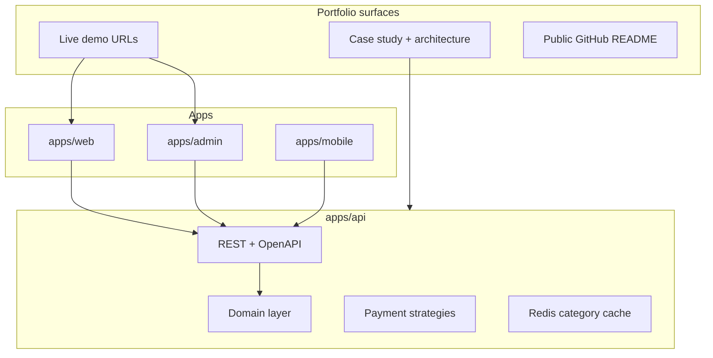

# E-commerce Portfolio Showcase — Development Plan

**Purpose:** Build a **production-quality portfolio piece** for Upwork and future clients—not a take-home assessment submission. Every phase should produce something you can **demo, screenshot, and explain** in a case study.

**Positioning on Upwork:** “Full-stack e-commerce: monorepo API + storefront + admin + mobile, real payments (Stripe + SSLCommerz), Redis caching, tested CI/CD, deployed demo.”

**Stack (unchanged, already in repo):**

- [apps/api](apps/api) — NestJS 11, Prisma via [@repo/database](packages/database)
- [apps/web](apps/web) — Next.js 16 storefront (`:3001`)
- [apps/admin](apps/admin) — Next.js 16 admin (`:3002`)
- [apps/mobile](apps/mobile) — Expo (React Native)
- Postgres 18 + Valkey 8 — [docker-compose.yml](docker-compose.yml)
- Payments: **Stripe** + **SSLCommerz** (Bangladesh gateway; no bKash)



---

## Modern standards (apply across all phases)

These are **non-negotiable portfolio signals**—weave them in as you go, not only at the end.

| Area              | Standard                                                                                                                                             |
| ----------------- | ---------------------------------------------------------------------------------------------------------------------------------------------------- |
| **Repo hygiene**  | Conventional commits, PR-sized chunks, `npm run validate` green before merge                                                                         |
| **CI**            | GitHub Actions: lint, typecheck, test, build on every push; Postgres service for API tests                                                           |
| **Git hooks**     | Husky + lint-staged (format + lint on staged files)                                                                                                  |
| **API**           | Versioned prefix `/api/v1`, OpenAPI/Swagger, global validation, consistent error shape, health/ready                                                 |
| **Security**      | Env validation, bcrypt, JWT + refresh optional, Helmet, CORS allowlist, rate limits, webhook signature verification, secrets never in client bundles |
| **Observability** | Structured logging (Pino), request ID middleware, redact secrets in logs                                                                             |
| **Data**          | Prisma migrations only, typed enums, indexes, idempotent webhooks, transactional stock updates                                                       |
| **Testing**       | Domain unit tests, API integration tests (supertest), webhook fixtures; target meaningful coverage on money paths                                    |
| **Frontends**     | Accessible UI (labels, focus, contrast), loading/error/empty states, responsive layout, shared `@repo/ui` design tokens                              |
| **DX**            | [.env.example](.env.example) complete, README with architecture diagram + “run locally in 5 minutes”                                                 |
| **Deploy**        | Dockerized API, Vercel for web/admin, public demo URL + seed credentials for reviewers                                                               |

**Removed from plan:** assessment submission minimums, bKash comparison table, “explain deviation to reviewers” notes.

---

## Phase 0 — Foundation and professional baseline (2–3 days)

**Goal:** Repo runs cleanly and looks intentional to a client opening GitHub.

| Task          | Details                                                                                                                                                           |
| ------------- | ----------------------------------------------------------------------------------------------------------------------------------------------------------------- |
| Schema        | [schema.prisma](packages/database/prisma/schema.prisma): Prisma enums (`OrderStatus`, `ProductStatus`, `PaymentStatus`, `PaymentProvider`), indexes on hot fields |
| Seed          | `prisma/seed.ts`: admin + demo customer + realistic catalog (categories 2–3 levels deep)                                                                          |
| API bootstrap | [main.ts](apps/api/src/main.ts): `PORT` from env, `ValidationPipe`, CORS, `/api/v1` global prefix                                                                 |
| CI + hooks    | `.github/workflows/ci.yml`, Husky + lint-staged                                                                                                                   |
| Env           | Extend [.env.example](.env.example): `JWT_*`, `API_URL`, Stripe, SSLCommerz, `REDIS_URL`                                                                          |

**Checkpoint:** `npm run validate` passes in CI locally; README “Quick start” works on a fresh clone.

---

## Phase 1 — Domain layer + auth (4–5 days)

**Goal:** Show clean architecture—domain rules separated from Nest infrastructure.

**Domain classes** (`packages/domain` or `apps/api/src/domain/`): `User`, `Product`, `Order`, `OrderItem`, `Payment` with invariants and `Order.calculateTotals()`.

**Modules:** `config`, `auth` (register/login/JWT), `users` (`/users/me`, orders, payments), `health`.

**Portfolio note:** Mention in case study: “Domain logic unit-tested without HTTP.”

**Checkpoint:** Swagger shows auth; protected routes return 401 without token.

---

## Phase 2 — Catalog, admin APIs, recommendations (4–5 days)

**Goal:** Demonstrate algorithms + caching—strong Upwork differentiator.

- Admin product/category CRUD (`@Roles('admin')`)
- Public catalog + `GET /products/:id/recommendations`
- **DFS** on category tree; **Redis** cache `category:tree:v1` with invalidation on category edits
- Stock/total rules: snapshot prices on order create; stock only after paid (Phase 4)

**Checkpoint:** Recommendations visible in API; Redis cache hit on repeat requests.

---

## Phase 3 — Orders (3–4 days)

- `POST /orders`, `GET /orders/:id`, `GET /users/me/orders`, `PATCH .../cancel`
- Prisma transactions; domain-driven totals

**Checkpoint:** Postman/curl E2E: login → create order → correct totals.

---

## Phase 4 — Payments — strategy pattern (6–8 days)

**Goal:** Highest portfolio impact—real money flows, done safely.

```typescript
interface PaymentStrategy {
      initiate(order, ctx): Promise<InitiateResult>;
      handleWebhook(headers, rawBody): Promise<WebhookResult>;
}
```

- `StripePaymentStrategy` + `SslcommerzPaymentStrategy`
- `POST /orders/:id/checkout`, webhooks with **idempotency** + transactional stock decrement on success
- Document flows in `docs/payments/` (sequence diagrams for client calls)

**Checkpoint:** Stripe test mode E2E; SSLCommerz sandbox E2E; duplicate webhook does not double-charge stock.

---

## Phase 5 — API hardening and observability (3–4 days)

- Global exception filter, Pino logging, Helmet, throttling
- `@nestjs/swagger` at `/api/docs`
- Optional: OpenTelemetry or simple request duration logs

**Checkpoint:** Errors are consistent JSON; logs never contain secrets.

---

## Phase 6 — Testing and technical docs (4–5 days)

**Tests:** domain units, API integration (auth, orders, payments), webhook fixtures with mocked providers.

**Docs (client-facing quality):**
| Doc | Path |
|-----|------|
| Architecture | `docs/architecture.md` |
| ERD | [docs/ERD.svg](docs/ERD.svg) |
| API | Swagger + exported Postman collection |
| Payments | `docs/payments/stripe.md`, `docs/payments/sslcommerz.md` |

**Checkpoint:** CI runs tests; README links to docs and live demo (when Phase 7 done).

---

## Phase 7 — Deployment and demo environment (3–4 days)

**Goal:** Give clients a **link**, not “clone and run.”

| Item          | Approach                                                                                           |
| ------------- | -------------------------------------------------------------------------------------------------- |
| API           | Multi-stage `apps/api/Dockerfile`; `docker-compose` for api + postgres + valkey                    |
| Frontends     | Vercel: web + admin with `NEXT_PUBLIC_API_URL`                                                     |
| Webhooks      | Stable API URL (Railway/Fly.io/Render or tunneled dev); document Stripe/SSLCommerz dashboard setup |
| Demo accounts | README: `demo@customer.com` / `admin@...` + test card instructions                                 |

**Checkpoint:** Public URLs work; one recorded or GIF walkthrough optional for Upwork profile.

---

## Phase 8 — Web storefront polish (6–8 days)

**Goal:** Visual proof of frontend skill—not a bare “Welcome” page.

- Design system via [@repo/ui](packages/ui): typography, buttons, cards, layout
- Auth, catalog, filters, product detail + recommendations, cart, checkout (Stripe Elements + SSLCommerz redirect), order history
- **UX:** skeletons, toasts, 404/empty states, mobile-responsive
- **Data:** TanStack Query or SWR; typed API client from `@repo/shared`

**Checkpoint:** Client can complete purchase on production demo URL.

---

## Phase 9 — Admin panel (5–6 days)

- Admin auth, product CRUD, category tree editor (cache invalidation), order/payment list, simple dashboard metrics
- Polished tables, filters, confirm dialogs for destructive actions

**Checkpoint:** Admin change reflects on storefront within seconds.

---

## Phase 10 — Expo mobile (8–10 days)

- Expo Router, shared types, auth, catalog, cart, checkout, orders
- EAS build notes in README (optional TestFlight/APK for portfolio)

**Checkpoint:** Same API, mobile happy path recorded for portfolio.

---

## Phase 11 — Portfolio packaging (2–3 days)

**New phase** — turns code into Upwork collateral.

| Deliverable          | Content                                                                        |
| -------------------- | ------------------------------------------------------------------------------ |
| `docs/CASE_STUDY.md` | Problem, stack, architecture, challenges (webhooks, stock, cache), screenshots |
| README hero          | Badges (CI, stack), demo links, feature bullet list                            |
| Upwork project entry | Title, 2-min scope, tech tags, links to GitHub + live demo                     |
| Optional             | 60–90s Loom: register → browse → pay → admin view order                        |

**Checkpoint:** You can send one link to a prospect that explains the whole system.

---

## Revised timeline (solo, part-time)

| Phases | Focus                    | ~Duration  |
| ------ | ------------------------ | ---------- |
| 0–1    | Foundation + auth        | ~1 week    |
| 2–4    | Core commerce + payments | ~2–3 weeks |
| 5–7    | Quality + deploy + docs  | ~1.5 weeks |
| 8–10   | Web + admin + mobile     | ~3–4 weeks |
| 11     | Portfolio packaging      | ~2–3 days  |

**Total:** ~8–10 weeks part-time for a **complete** showcase.

**MVP for first Upwork listing (faster):** Phases 0–7 + Phase 8 (basic web) + Phase 11 — add admin polish and mobile incrementally.

---

## How we work (guide mode)

Message **“Starting Phase N”** for a file-level checklist, review before payment/webhook work, and checkpoint verification. Prioritize **demo-ready** over feature count.

---

## First action

**Phase 0:** enums/indexes, seed, CI workflow, Husky, API global prefix + validation. Confirm when `npm run validate` is green.
