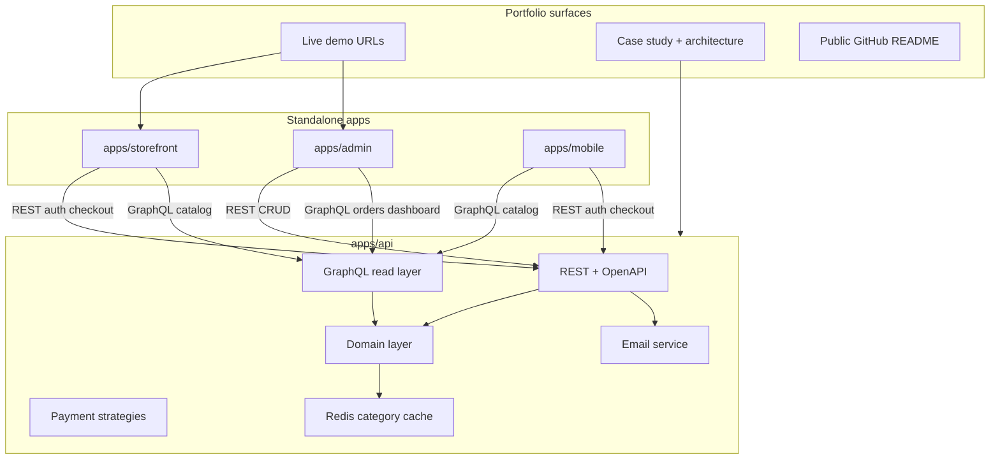

# E-commerce Portfolio Showcase — Development Plan

**Changelog:** _2026-06-27 — added hybrid REST + GraphQL architecture, email verification (browse OK / checkout gated), refresh token rotation, password reset, Google OAuth, account lockout, and expanded security hardening._

**Purpose:** Build a **production-quality portfolio piece** for Upwork and future clients—not a take-home assessment submission. Every phase should produce something you can **demo, screenshot, and explain** in a case study.

**Positioning on Upwork:** “Full-stack e-commerce: NestJS API with **REST + GraphQL**, Next.js storefront + admin + mobile, email-verified accounts, real payments (Stripe + SSLCommerz), Redis caching, tested CI/CD, deployed demo.”

---

## Repository layout — co-app (not a monorepo)

Apps live in one Git repo for portfolio convenience, but **each app is fully independent**: its own `package.json`, `package-lock.json`, dependencies, lint/test/build scripts, and deploy target. **No** npm workspaces, **no** Turborepo, **no** `packages/` shared libraries.

| Path                               | Role                                              | Port |
| ---------------------------------- | ------------------------------------------------- | ---- |
| [apps/api](apps/api)               | NestJS 11 + Prisma (schema in `apps/api/prisma/`) | 3000 |
| [apps/storefront](apps/storefront) | Next.js 16 customer storefront                    | 3002 |
| [apps/admin](apps/admin)           | Next.js 16 admin panel                            | 3001 |
| [apps/mobile](apps/mobile)         | Expo (React Native) — add when starting Phase 10  | —    |

**Shared at repo root only (infrastructure & docs, not code):**

- [docker-compose.yml](docker-compose.yml) — Postgres 18 + Valkey 8 (+ Mailpit in Phase 5 for local email)
- [README.md](README.md) — how to run each app
- [docs/](docs/) — architecture, case study, payment guides
- Optional root [package.json](package.json) — `concurrently` dev shortcuts only; must not declare `workspaces`

**Cross-app integration:** Hybrid **REST + GraphQL**. REST handles auth, mutations, checkout, and webhooks with OpenAPI/Swagger. GraphQL handles nested read screens (catalog, product detail, order detail, dashboard). Each frontend uses **two clients**: GraphQL (`@apollo/client` or `urql`) for reads; REST (OpenAPI-generated or hand-written) for writes and auth. Duplicate UI components across storefront and admin if needed—**do not** extract a shared UI package for this portfolio.



### API boundary rules — REST vs GraphQL

| Use REST                                                             | Use GraphQL                                      |
| -------------------------------------------------------------------- | ------------------------------------------------ |
| Auth (register, login, refresh, verify-email, password reset, OAuth) | Product catalog list/detail with nested category |
| Admin CRUD (products, categories)                                    | Category tree + breadcrumbs                      |
| Orders, checkout, cancel                                             | Product recommendations                          |
| Payment webhooks (Stripe, SSLCommerz)                                | Admin order detail (user + items + payments)     |
| Health, rate-limited public metadata                                 | Customer order history (authenticated)           |
| File uploads (future product images)                                 | Admin dashboard aggregates (optional)            |

**Client env vars (add per app when wiring frontends):**

- `NEXT_PUBLIC_API_URL` / `EXPO_PUBLIC_API_URL` — REST base
- `NEXT_PUBLIC_GRAPHQL_URL` / `EXPO_PUBLIC_GRAPHQL_URL` — GraphQL endpoint (e.g. `http://localhost:3000/graphql`)

**GraphQL Playground:** enabled in development at `/graphql`; disable introspection in production.

---

## Modern standards (apply across all phases)

These are **non-negotiable portfolio signals**—weave them in as you go, not only at the end.

| Area              | Standard                                                                                                                                              |
| ----------------- | ----------------------------------------------------------------------------------------------------------------------------------------------------- |
| **Repo hygiene**  | Conventional commits, PR-sized chunks; each app’s `lint` + `check-types` + `test` + `build` green before merge                                        |
| **CI**            | GitHub Actions: **separate job per app** (`working-directory: apps/api`, etc.); Postgres service only on API job                                      |
| **Quality gate**  | GitHub Actions per app (`lint`, `check-types`, `test` where defined, `build`)—**no Husky/lint-staged**; run checks locally or rely on CI before merge |
| **API**           | Versioned prefix `/api/v1` for REST; GraphQL at `/graphql`; OpenAPI/Swagger; global validation; consistent error shape; health/ready                  |
| **Observability** | Structured logging (Pino) in API, request ID middleware, redact secrets in logs                                                                       |
| **Data**          | Prisma migrations only under `apps/api/prisma/`, typed enums, indexes, idempotent webhooks, transactional stock updates                               |
| **Testing**       | Tests live **inside each app**; API: domain units + supertest + GraphQL resolver tests; frontends: component/e2e as appropriate                       |
| **Frontends**     | Accessible UI, loading/error/empty states, responsive layout; **local** components per app (no shared design-system package)                          |
| **DX**            | README “run locally” lists `cd apps/<app>` steps; root README links to each app’s env vars                                                            |
| **Deploy**        | API container from `apps/api`; Vercel projects for storefront + admin (separate); public demo URLs + seed credentials                                 |

### Identity & security (apply across Phases 1, 3, 4, 5)

| Control                | Where                          | Notes                                                                                                                    |
| ---------------------- | ------------------------------ | ------------------------------------------------------------------------------------------------------------------------ |
| Email verification     | Phase 1 schema + Phase 5 flows | **Policy:** login + browse allowed; **checkout/orders blocked** until `emailVerifiedAt` is set                           |
| Refresh token rotation | Phase 1                        | `JWT_REFRESH_*` in [`.env.example`](.env.example); store hashed refresh tokens in DB; rotate on use                      |
| Password reset         | Phase 5                        | Time-limited single-use tokens via email                                                                                 |
| Google OAuth           | Phase 5                        | `GOOGLE_CLIENT_*` already documented; link or create customer accounts; set `emailVerifiedAt` when Google confirms email |
| Password policy        | Phase 1                        | Min length, complexity via DTO + domain `User` rules; bcrypt rounds 12                                                   |
| Rate limiting          | Phase 5                        | `@nestjs/throttler` — strict on `/auth/*`, moderate global                                                               |
| Account lockout        | Phase 5                        | Lock after N failed logins (e.g. 5 in 15 min); store `failedLoginAttempts` / `lockedUntil` on User                       |
| Helmet + CORS          | Phase 5                        | CORS allowlist in [`main.ts`](apps/api/src/main.ts); add Helmet                                                          |
| Webhook signatures     | Phase 4                        | Stripe + SSLCommerz (unchanged)                                                                                          |
| Field-level auth       | Phase 2 GraphQL                | `@UseGuards` on resolvers; hide admin fields from public schema                                                          |
| GraphQL hardening      | Phase 5                        | Query depth/complexity limits; disable introspection in production                                                       |
| Secrets in logs        | Phase 5                        | Pino redaction paths                                                                                                     |
| Generic auth errors    | Phase 1                        | “Invalid credentials” — no email enumeration on login                                                                    |

**Email provider:** [Resend](https://resend.com) for production; [Mailpit](https://mailpit.axllent.org/) in Docker for local dev (add to [`docker-compose.yml`](docker-compose.yml) in Phase 5).

**New env vars (document in `.env.example` during Phase 1/5):**

```bash
RESEND_API_KEY=
EMAIL_FROM=noreply@yourdomain.com
APP_URL=http://localhost:3002          # verification/reset link base (storefront)
EMAIL_VERIFICATION_TOKEN_TTL=24h
PASSWORD_RESET_TOKEN_TTL=1h
```

**Removed from plan:** monorepo/Turborepo, `packages/*`, `@repo/*` shared packages, assessment submission minimums, bKash comparison table, **Husky/lint-staged** (CI is the pre-merge gate).

---

## Phase 0 — Foundation and professional baseline (2–3 days)

**Goal:** Each app runs cleanly; GitHub looks intentional to a client.

| Task          | Status  | Details                                                                                                                                                                     |
| ------------- | ------- | --------------------------------------------------------------------------------------------------------------------------------------------------------------------------- |
| Schema        | Done    | `apps/api/prisma/schema.prisma`: enums + indexes; initial migration under `prisma/migrations/`                                                                              |
| Seed          | Done    | `apps/api/prisma/seed.ts`: `admin@demo.local`, `demo@customer.com`, 3-level categories, 17 products                                                                         |
| API bootstrap | Done    | [apps/api/src/main.ts](apps/api/src/main.ts): `/api/v1`, `ValidationPipe`, CORS, `PORT` via `ConfigService` + [env.validation.ts](apps/api/src/config/env.validation.ts)    |
| CI            | Done    | [.github/workflows/ci.yml](.github/workflows/ci.yml): parallel **API** / **Storefront** / **Admin**; Postgres service on API only; `lint:ci` + `check-types` + `test` (API) |
| Git hooks     | Skip    | **No Husky/lint-staged** — quality enforced in CI only                                                                                                                      |
| Env           | Partial | Root [`.env.example`](.env.example) + README (shared root `.env`); `JWT_*` and email env placeholders deferred to Phase 1/5; per-app `.env.example` optional                |

**Checkpoint:** CI green for all three apps on GitHub Actions; README quick start works (repo uses **root** `.env` + `npm run dev:*`, with per-app commands documented).

### Phase 0 progress (last updated: 2026-06-03)

| Area             | Notes                                                                                                                                                                                                                                                       |
| ---------------- | ----------------------------------------------------------------------------------------------------------------------------------------------------------------------------------------------------------------------------------------------------------- |
| **Done**         | Prisma under `apps/api/prisma/`; docker-compose Postgres 18 + Valkey 8; root `package.json` dev/db scripts (no workspaces); API `lint:ci` / `check-types` / `test` / `build`; storefront & admin `check-types` + `build`; ESLint ignores `src/generated/**` |
| **Verify**       | Push/PR to `main` and confirm all three CI jobs pass (Node 24 in Actions; local API needs Node ≥ 24 for `db:generate`)                                                                                                                                      |
| **Remaining**    | Optional: CI badge in README; confirm green Actions run; add `JWT_*` + email env placeholders to `.env.example` when starting Phase 1                                                                                                                       |
| **Out of scope** | Husky, lint-staged, per-app `.env.example` files (unless you split env later); Mailpit (Phase 5)                                                                                                                                                            |

---

## Phase 1 — Domain layer + auth foundation (5–6 days)

**Goal:** Show clean architecture—domain rules in the API only, not shared across repos. Establish identity schema and JWT flows that later phases build on.

**Domain classes** (`apps/api/src/domain/`): `User`, `Product`, `Order`, `OrderItem`, `Payment` with invariants and `Order.calculateTotals()`.

**Prisma identity schema additions** (migration under [`apps/api/prisma/schema.prisma`](apps/api/prisma/schema.prisma)):

```prisma
model User {
  // existing fields...
  emailVerifiedAt     DateTime?
  failedLoginAttempts Int       @default(0)
  lockedUntil         DateTime?
  refreshTokens       RefreshToken[]
  authTokens          AuthToken[]
}

model RefreshToken {
  id        String    @id @default(cuid())
  userId    String
  user      User      @relation(fields: [userId], references: [id], onDelete: Cascade)
  tokenHash String    @unique
  expiresAt DateTime
  revokedAt DateTime?
  createdAt DateTime  @default(now())
}

model AuthToken {
  id        String        @id @default(cuid())
  userId    String
  user      User          @relation(fields: [userId], references: [id], onDelete: Cascade)
  type      AuthTokenType
  tokenHash String        @unique
  expiresAt DateTime
  usedAt    DateTime?
  createdAt DateTime      @default(now())
}

enum AuthTokenType {
  email_verification
  password_reset
}
```

**Seed update:** set `emailVerifiedAt` on demo accounts so local dev is not blocked at checkout.

**REST endpoints** (`/api/v1/auth`):

- `POST register` — create user, queue verification email (stub OK until Phase 5), return access + refresh (user can browse)
- `POST login` / `POST refresh` / `POST logout`
- `POST resend-verification` (rate-limited, authenticated) — full email send in Phase 5
- `GET verify-email?token=` — stub redirect OK; full flow in Phase 5

**Guards:**

- `JwtAuthGuard` (exists)
- `EmailVerifiedGuard` — returns `403` with clear message; wired in Phase 3 on order/checkout endpoints

**Modules:** `config`, `auth`, `users` (`/users/me`, orders, payments), `health`, `mail` (Resend/Mailpit adapter stub)

**Portfolio note:** Mention in case study: “Domain logic unit-tested without HTTP.”

**Checkpoint:** Swagger shows auth; protected routes return 401 without token; refresh flow works; unverified user gets 403 on order create (stub endpoint OK).

---

## Phase 2 — Catalog, admin APIs, GraphQL read layer, recommendations (6–7 days)

**Goal:** Demonstrate algorithms + caching + GraphQL read optimization—strong Upwork differentiator.

**REST (admin + OpenAPI, existing pattern):**

- Admin product/category CRUD (`@Roles('admin')`) via [`categories.controller.ts`](apps/api/src/categories/categories.controller.ts) pattern
- Optional thin REST `GET /products` for Postman; primary public reads move to GraphQL

**GraphQL module** (`apps/api/src/graphql/`):

- `@nestjs/graphql` + `@apollo/server` (code-first)
- Mount at `/graphql` (document consistently in README and env vars)

**Initial queries:**

```graphql
type Query {
      products(filter: ProductFilterInput, pagination: PaginationInput): ProductConnection!
      product(id: ID, slug: String): Product
      categoryTree: [Category!]!
      recommendations(productId: ID!, limit: Int = 8): [Product!]!
}
```

- Resolvers delegate to `ProductsService` / `CategoriesService` — no business logic in resolvers
- **DataLoader** for `Product.category`, `Category.children`, recommendations (avoid N+1)
- Public vs admin: catalog queries public; no admin mutations in GraphQL (REST only)

**Algorithms + caching (unchanged):**

- **DFS** on category tree; **Redis** cache `category:tree:v1` with invalidation on category edits
- `categoryTree` GraphQL query reuses Redis-backed DFS cache
- Stock/total rules: snapshot prices on order create; stock only after paid (Phase 4)

**Checkpoint:** GraphQL Playground returns product with nested category + recommendations in one query; Redis cache hit on repeat `categoryTree`; DataLoader verified in tests.

---

## Phase 3 — Orders (3–4 days)

- `POST /orders`, `GET /orders/:id`, `GET /users/me/orders`, `PATCH .../cancel`
- Prisma transactions; domain-driven totals
- Apply **`EmailVerifiedGuard`** on `POST /orders` and checkout initiation — unverified users may browse but cannot place orders

**GraphQL (customer reads):**

- Add authenticated `myOrders` query for storefront/mobile order history (nested items + product summary)
- Keep REST `GET /users/me/orders` as optional fallback for Postman/OpenAPI parity

**Checkpoint:** Postman/curl E2E: login → create order → correct totals; unverified user blocked at order create; verified user succeeds.

---

## Phase 4 — Payments — strategy pattern (6–8 days)

**Goal:** Highest portfolio impact—real money flows, done safely.

```typescript
interface PaymentStrategy {
      initiate(order, ctx): Promise<InitiateResult>;
      handleWebhook(headers, rawBody): Promise<WebhookResult>;
}
```

- `StripePaymentStrategy` + `SslcommerzPaymentStrategy`
- `POST /orders/:id/checkout`, webhooks with **idempotency** + transactional stock decrement on success
- Checkout endpoints also require **`EmailVerifiedGuard`**
- Webhooks stay **REST only** (raw body, signature verification)
- Document flows in `docs/payments/` (sequence diagrams for client calls)

**Checkpoint:** Stripe test mode E2E; SSLCommerz sandbox E2E; duplicate webhook does not double-charge stock; unverified user blocked at checkout.

---

## Phase 5 — Identity security + API hardening and observability (5–6 days)

**Goal:** Production-grade identity flows and API hardening.

**Identity (REST):**

- `GET verify-email?token=` — mark `emailVerifiedAt`, redirect to storefront success page
- `POST resend-verification` — send via mail module (rate-limited)
- `POST forgot-password` → email with reset link
- `POST reset-password` → validate token, update hash, revoke all refresh tokens
- Google OAuth: `GET /auth/google`, `GET /auth/google/callback` — set `emailVerifiedAt` when Google confirms email
- HTML email templates (verify, reset) in `apps/api/src/mail/templates/`
- Add **Mailpit** to [`docker-compose.yml`](docker-compose.yml) for local email capture

**Hardening & observability:**

- Global exception filter, Pino logging + secret redaction, Helmet, `@nestjs/throttler`
- Account lockout logic in login flow (`failedLoginAttempts`, `lockedUntil`)
- GraphQL: query depth/complexity limits; disable introspection in production
- `@nestjs/swagger` at `/api/docs`; GraphQL Playground dev-only
- Optional: OpenTelemetry or simple request duration logs

**Checkpoint:** Full verify → browse → checkout blocked → verify → checkout allowed flow; password reset E2E; rate limit returns 429 on auth spam; errors are consistent JSON; logs never contain secrets.

---

## Phase 6 — Testing and technical docs (4–5 days)

**Tests (all under `apps/api` unless noted):** domain units, API integration (auth, orders, payments), webhook fixtures with mocked providers. **New:** auth tests (verification token expiry, refresh rotation, lockout, `EmailVerifiedGuard`); GraphQL resolver integration + DataLoader batching; mail mock transport in CI (no real sends). Frontends: add tests in their own folders when UI grows.

**Docs (client-facing quality):**

| Doc             | Path                                                                   |
| --------------- | ---------------------------------------------------------------------- |
| Architecture    | `docs/architecture.md` — hybrid REST/GraphQL diagram                   |
| ERD             | `docs/ERD.svg`                                                         |
| API             | Swagger + exported Postman collection                                  |
| Auth & security | `docs/security/auth-flows.md` — verify, reset, OAuth sequence diagrams |
| GraphQL         | `docs/graphql.md` — queries, auth header, playground                   |
| Payments        | `docs/payments/stripe.md`, `docs/payments/sslcommerz.md`               |

**Checkpoint:** CI runs API tests; README links to docs and live demo (when Phase 7 done).

---

## Phase 7 — Deployment and demo environment (3–4 days)

**Goal:** Give clients a **link**, not “clone and run.”

| Item          | Approach                                                                                       |
| ------------- | ---------------------------------------------------------------------------------------------- |
| API           | `apps/api/Dockerfile` (multi-stage); compose stacks api + postgres + valkey                    |
| Storefront    | Separate Vercel project → `apps/storefront`, `NEXT_PUBLIC_API_URL` + `NEXT_PUBLIC_GRAPHQL_URL` |
| Admin         | Separate Vercel project → `apps/admin`, `NEXT_PUBLIC_API_URL` + `NEXT_PUBLIC_GRAPHQL_URL`      |
| Webhooks      | Stable API URL (Railway/Fly.io/Render); document Stripe/SSLCommerz dashboard setup             |
| Email         | Resend with verified domain; document `EMAIL_FROM` and `APP_URL` for production links          |
| Demo accounts | README: `demo@customer.com` / `admin@...` + test card instructions                             |

**Checkpoint:** Public URLs work; optional GIF walkthrough for Upwork profile.

---

## Phase 8 — Storefront polish (6–8 days)

**Goal:** Visual proof of frontend skill—not a bare “Welcome” page.

- **Local** design tokens and components in `apps/storefront` (typography, buttons, cards, layout)
- Auth, catalog, filters, product detail + recommendations, cart, checkout (Stripe Elements + SSLCommerz redirect), order history
- **UX:** skeletons, toasts, 404/empty states, mobile-responsive
- **Unverified user UX:** banner prompting email verification; `/verify-email`, `/forgot-password`, `/reset-password` pages
- **Data:**
     - **GraphQL** (Apollo Client or urql): home, catalog, product detail, recommendations, order history
     - **REST** (OpenAPI-generated or hand-written client): auth, cart mutations, checkout, payment redirects
     - Env: `NEXT_PUBLIC_API_URL`, `NEXT_PUBLIC_GRAPHQL_URL`

**Checkpoint:** Client can complete purchase on production demo URL; unverified user sees browse-but-not-checkout flow.

---

## Phase 9 — Admin panel (5–6 days)

- Standalone UI in `apps/admin` (tables, forms, category tree editor with cache invalidation triggers via API)
- Admin auth, product CRUD, order/payment list, simple dashboard metrics
- Polished tables, filters, confirm dialogs for destructive actions
- **Data:**
     - **GraphQL:** order detail, dashboard metrics, order list with nested user/items/payments
     - **REST:** product/category CRUD, destructive actions (OpenAPI client — no shared package)
- Show customer email verification status on order views where relevant

**Checkpoint:** Admin change reflects on storefront within seconds.

---

## Phase 10 — Expo mobile (8–10 days)

- New folder `apps/mobile`: own `package.json`, Expo Router, env for `EXPO_PUBLIC_API_URL` + `EXPO_PUBLIC_GRAPHQL_URL`
- **GraphQL** for catalog/product screens (lean field selection — id, name, price, image)
- **REST** for auth, cart, checkout, orders
- Types/clients generated or copied in **this app only**; no import from storefront/admin
- EAS build notes in `apps/mobile/README` (optional TestFlight/APK for portfolio)

**Checkpoint:** Mobile happy path recorded for portfolio.

---

## Phase 11 — Portfolio packaging (2–3 days)

**New phase** — turns code into Upwork collateral.

| Deliverable          | Content                                                                               |
| -------------------- | ------------------------------------------------------------------------------------- |
| `docs/CASE_STUDY.md` | Problem, stack, co-app architecture, challenges (webhooks, stock, cache), screenshots |
| README hero          | Badges (CI per app), demo links, feature bullet list, “standalone apps” diagram       |
| Upwork project entry | Title, 2-min scope, tech tags, links to GitHub + live demo                            |
| Optional             | 60–90s Loom: register → browse → pay → admin view order                               |

**Case study bullets to include:**

- Why hybrid REST + GraphQL (not GraphQL everywhere)
- Email verification policy and checkout gating
- Refresh token rotation and account lockout
- DataLoader + Redis cache story

**Checkpoint:** You can send one link to a prospect that explains the whole system.

---

## Revised timeline (solo, part-time)

| Phases | Focus                              | ~Duration  |
| ------ | ---------------------------------- | ---------- |
| 0–1    | Foundation + auth/identity schema  | ~1.5 weeks |
| 2      | Catalog + GraphQL read layer       | ~1.5 weeks |
| 3–4    | Core commerce + payments           | ~2–3 weeks |
| 5–7    | Security hardening + deploy + docs | ~2 weeks   |
| 8–10   | Storefront + admin + mobile        | ~3–4 weeks |
| 11     | Portfolio packaging                | ~2–3 days  |

**Total:** ~9–11 weeks part-time for a **complete** showcase.

**MVP for first Upwork listing (faster):** Phases 0–7 + Phase 8 (basic storefront with GraphQL catalog) + Phase 11 — add admin polish, mobile, and full OAuth incrementally.

---

## How we work (guide mode)

Message **“Starting Phase N”** for a file-level checklist, review before payment/webhook work, and checkpoint verification. Prioritize **demo-ready** over feature count.

---

## First action

**Phase 0:** Prisma + seed + API bootstrap are in place; per-app CI jobs are configured (no Husky). **Close Phase 0** after one green GitHub Actions run for API, Storefront, and Admin.

**Phase 1:** Start domain + JWT access/refresh + Prisma identity fields (`emailVerifiedAt`, `RefreshToken`, `AuthToken`) + `mail` module stub; seed demo users with `emailVerifiedAt` set. GraphQL read layer lands in Phase 2; full email verification, password reset, and OAuth flows land in Phase 5.
