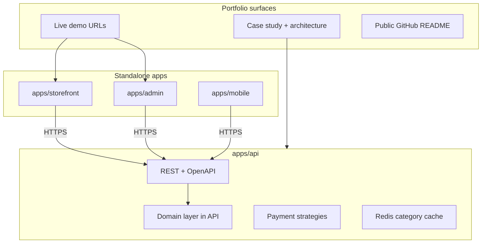

# E-commerce Portfolio Showcase — Development Plan

**Purpose:** Build a **production-quality portfolio piece** for Upwork and future clients—not a take-home assessment submission. Every phase should produce something you can **demo, screenshot, and explain** in a case study.

**Positioning on Upwork:** “Full-stack e-commerce: standalone API + storefront + admin + mobile, real payments (Stripe + SSLCommerz), Redis caching, tested CI/CD, deployed demo.”

---

## Repository layout — co-app (not a monorepo)

Apps live in one Git repo for portfolio convenience, but **each app is fully independent**: its own `package.json`, `package-lock.json`, dependencies, lint/test/build scripts, and deploy target. **No** npm workspaces, **no** Turborepo, **no** `packages/` shared libraries.

| Path                               | Role                                              | Port |
| ---------------------------------- | ------------------------------------------------- | ---- |
| [apps/api](apps/api)               | NestJS 11 + Prisma (schema in `apps/api/prisma/`) | 3000 |
| [apps/storefront](apps/storefront) | Next.js 16 customer storefront                    | 3002 |
| [apps/admin](apps/admin)           | Next.js 16 admin panel                            | 3001 |
| [apps/mobile](apps/mobile)         | Expo (React Native) — add when starting Phase 10  | —    |

**Shared at repo root only (infrastructure & docs, not code):**

- [docker-compose.yml](docker-compose.yml) — Postgres 18 + Valkey 8
- [README.md](README.md) — how to run each app
- [docs/](docs/) — architecture, case study, payment guides
- Optional root [package.json](package.json) — `concurrently` dev shortcuts only; must not declare `workspaces`

**Cross-app integration:** HTTP + OpenAPI. Each frontend generates or hand-writes its own API client and types (e.g. `openapi-typescript` run inside that app). Duplicate UI components across storefront and admin if needed—**do not** extract a shared UI package for this portfolio.



---

## Modern standards (apply across all phases)

These are **non-negotiable portfolio signals**—weave them in as you go, not only at the end.

| Area              | Standard                                                                                                                                              |
| ----------------- | ----------------------------------------------------------------------------------------------------------------------------------------------------- |
| **Repo hygiene**  | Conventional commits, PR-sized chunks; each app’s `lint` + `check-types` + `test` + `build` green before merge                                        |
| **CI**            | GitHub Actions: **separate job per app** (`working-directory: apps/api`, etc.); Postgres service only on API job                                      |
| **Quality gate**  | GitHub Actions per app (`lint`, `check-types`, `test` where defined, `build`)—**no Husky/lint-staged**; run checks locally or rely on CI before merge |
| **API**           | Versioned prefix `/api/v1`, OpenAPI/Swagger, global validation, consistent error shape, health/ready                                                  |
| **Security**      | Per-app `.env.example`; env validation in API; bcrypt, JWT, Helmet, CORS allowlist, rate limits, webhook signatures; secrets never in client bundles  |
| **Observability** | Structured logging (Pino) in API, request ID middleware, redact secrets in logs                                                                       |
| **Data**          | Prisma migrations only under `apps/api/prisma/`, typed enums, indexes, idempotent webhooks, transactional stock updates                               |
| **Testing**       | Tests live **inside each app**; API: domain units + supertest; frontends: component/e2e as appropriate                                                |
| **Frontends**     | Accessible UI, loading/error/empty states, responsive layout; **local** components per app (no shared design-system package)                          |
| **DX**            | README “run locally” lists `cd apps/<app>` steps; root README links to each app’s env vars                                                            |
| **Deploy**        | API container from `apps/api`; Vercel projects for storefront + admin (separate); public demo URLs + seed credentials                                 |

**Removed from plan:** monorepo/Turborepo, `packages/*`, `@repo/*` shared packages, assessment submission minimums, bKash comparison table, **Husky/lint-staged** (CI is the pre-merge gate).

---

## Phase 0 — Foundation and professional baseline (2–3 days)

**Goal:** Each app runs cleanly; GitHub looks intentional to a client.

| Task          | Status  | Details                                                                                                                                                                     |
| ------------- | ------- | --------------------------------------------------------------------------------------------------------------------------------------------------------------------------- |
| Schema        | Done    | `apps/api/prisma/schema.prisma`: enums + indexes; initial migration under `prisma/migrations/`                                                                              |
| Seed          | Done    | `apps/api/prisma/seed.ts`: `admin@demo.local`, `demo@customer.com`, 3-level categories, 17 products                                                                         |
| API bootstrap | Done    | [apps/api/src/main.ts](apps/api/src/main.ts): `/api/v1`, `ValidationPipe`, CORS, `PORT` via `ConfigService` + [env.validation.ts](apps/api/src/config/env.validation.ts)    |
| CI            | Done    | [.github/workflows/ci.yml](.github/workflows/ci.yml): parallel **API** / **Storefront** / **Admin**; Postgres service on API only; `lint:ci` + `check-types` + `test` (API) |
| Git hooks     | Skip    | **No Husky/lint-staged** — quality enforced in CI only                                                                                                                      |
| Env           | Partial | Root [`.env.example`](.env.example) + README (shared root `.env`); `JWT_*` deferred to Phase 1; per-app `.env.example` optional                                             |

**Checkpoint:** CI green for all three apps on GitHub Actions; README quick start works (repo uses **root** `.env` + `npm run dev:*`, with per-app commands documented).

### Phase 0 progress (last updated: 2026-06-03)

| Area             | Notes                                                                                                                                                                                                                                                       |
| ---------------- | ----------------------------------------------------------------------------------------------------------------------------------------------------------------------------------------------------------------------------------------------------------- |
| **Done**         | Prisma under `apps/api/prisma/`; docker-compose Postgres 18 + Valkey 8; root `package.json` dev/db scripts (no workspaces); API `lint:ci` / `check-types` / `test` / `build`; storefront & admin `check-types` + `build`; ESLint ignores `src/generated/**` |
| **Verify**       | Push/PR to `main` and confirm all three CI jobs pass (Node 24 in Actions; local API needs Node ≥ 24 for `db:generate`)                                                                                                                                      |
| **Remaining**    | Optional: CI badge in README; confirm green Actions run; add `JWT_*` to `.env.example` when starting Phase 1                                                                                                                                                |
| **Out of scope** | Husky, lint-staged, per-app `.env.example` files (unless you split env later)                                                                                                                                                                               |

---

## Phase 1 — Domain layer + auth (4–5 days)

**Goal:** Show clean architecture—domain rules in the API only, not shared across repos.

**Domain classes** (`apps/api/src/domain/`): `User`, `Product`, `Order`, `OrderItem`, `Payment` with invariants and `Order.calculateTotals()`.

**Modules:** `config`, `auth` (register/login/JWT), `users` (`/users/me`, orders, payments), `health`.

**Portfolio note:** Mention in case study: “Domain logic unit-tested without HTTP.”

**Checkpoint:** Swagger shows auth; protected routes return 401 without token.

---

## Phase 2 — Catalog, admin APIs, recommendations (4–5 days)

**Goal:** Demonstrate algorithms + caching—strong Upwork differentiator.

- Admin product/category CRUD (`@Roles('admin')`)
- Public catalog + `GET /products/:id/recommendations`
- **DFS** on category tree; **Redis** cache `category:tree:v1` with invalidation on category edits
- Stock/total rules: snapshot prices on order create; stock only after paid (Phase 4)

**Checkpoint:** Recommendations visible in API; Redis cache hit on repeat requests.

---

## Phase 3 — Orders (3–4 days)

- `POST /orders`, `GET /orders/:id`, `GET /users/me/orders`, `PATCH .../cancel`
- Prisma transactions; domain-driven totals

**Checkpoint:** Postman/curl E2E: login → create order → correct totals.

---

## Phase 4 — Payments — strategy pattern (6–8 days)

**Goal:** Highest portfolio impact—real money flows, done safely.

```typescript
interface PaymentStrategy {
      initiate(order, ctx): Promise<InitiateResult>;
      handleWebhook(headers, rawBody): Promise<WebhookResult>;
}
```

- `StripePaymentStrategy` + `SslcommerzPaymentStrategy`
- `POST /orders/:id/checkout`, webhooks with **idempotency** + transactional stock decrement on success
- Document flows in `docs/payments/` (sequence diagrams for client calls)

**Checkpoint:** Stripe test mode E2E; SSLCommerz sandbox E2E; duplicate webhook does not double-charge stock.

---

## Phase 5 — API hardening and observability (3–4 days)

- Global exception filter, Pino logging, Helmet, throttling
- `@nestjs/swagger` at `/api/docs`
- Optional: OpenTelemetry or simple request duration logs

**Checkpoint:** Errors are consistent JSON; logs never contain secrets.

---

## Phase 6 — Testing and technical docs (4–5 days)

**Tests (all under `apps/api` unless noted):** domain units, API integration (auth, orders, payments), webhook fixtures with mocked providers. Frontends: add tests in their own folders when UI grows.

**Docs (client-facing quality):**
| Doc | Path |
|-----|------|
| Architecture | `docs/architecture.md` |
| ERD | `docs/ERD.svg` |
| API | Swagger + exported Postman collection |
| Payments | `docs/payments/stripe.md`, `docs/payments/sslcommerz.md` |

**Checkpoint:** CI runs API tests; README links to docs and live demo (when Phase 7 done).

---

## Phase 7 — Deployment and demo environment (3–4 days)

**Goal:** Give clients a **link**, not “clone and run.”

| Item          | Approach                                                                           |
| ------------- | ---------------------------------------------------------------------------------- |
| API           | `apps/api/Dockerfile` (multi-stage); compose stacks api + postgres + valkey        |
| Storefront    | Separate Vercel project → `apps/storefront`, `NEXT_PUBLIC_API_URL`                 |
| Admin         | Separate Vercel project → `apps/admin`, `NEXT_PUBLIC_API_URL`                      |
| Webhooks      | Stable API URL (Railway/Fly.io/Render); document Stripe/SSLCommerz dashboard setup |
| Demo accounts | README: `demo@customer.com` / `admin@...` + test card instructions                 |

**Checkpoint:** Public URLs work; optional GIF walkthrough for Upwork profile.

---

## Phase 8 — Storefront polish (6–8 days)

**Goal:** Visual proof of frontend skill—not a bare “Welcome” page.

- **Local** design tokens and components in `apps/storefront` (typography, buttons, cards, layout)
- Auth, catalog, filters, product detail + recommendations, cart, checkout (Stripe Elements + SSLCommerz redirect), order history
- **UX:** skeletons, toasts, 404/empty states, mobile-responsive
- **Data:** TanStack Query or SWR; API client + types generated **inside** `apps/storefront` from OpenAPI (or maintained locally)

**Checkpoint:** Client can complete purchase on production demo URL.

---

## Phase 9 — Admin panel (5–6 days)

- Standalone UI in `apps/admin` (tables, forms, category tree editor with cache invalidation triggers via API)
- Admin auth, product CRUD, order/payment list, simple dashboard metrics
- Polished tables, filters, confirm dialogs for destructive actions
- Own API client/types (same OpenAPI approach as storefront—no shared package)

**Checkpoint:** Admin change reflects on storefront within seconds.

---

## Phase 10 — Expo mobile (8–10 days)

- New folder `apps/mobile`: own `package.json`, Expo Router, env for `EXPO_PUBLIC_API_URL`
- Auth, catalog, cart, checkout, orders against the same REST API
- Types/client generated or copied in **this app only**; no import from storefront/admin
- EAS build notes in `apps/mobile/README` (optional TestFlight/APK for portfolio)

**Checkpoint:** Mobile happy path recorded for portfolio.

---

## Phase 11 — Portfolio packaging (2–3 days)

**New phase** — turns code into Upwork collateral.

| Deliverable          | Content                                                                               |
| -------------------- | ------------------------------------------------------------------------------------- |
| `docs/CASE_STUDY.md` | Problem, stack, co-app architecture, challenges (webhooks, stock, cache), screenshots |
| README hero          | Badges (CI per app), demo links, feature bullet list, “standalone apps” diagram       |
| Upwork project entry | Title, 2-min scope, tech tags, links to GitHub + live demo                            |
| Optional             | 60–90s Loom: register → browse → pay → admin view order                               |

**Checkpoint:** You can send one link to a prospect that explains the whole system.

---

## Revised timeline (solo, part-time)

| Phases | Focus                       | ~Duration  |
| ------ | --------------------------- | ---------- |
| 0–1    | Foundation + auth           | ~1 week    |
| 2–4    | Core commerce + payments    | ~2–3 weeks |
| 5–7    | Quality + deploy + docs     | ~1.5 weeks |
| 8–10   | Storefront + admin + mobile | ~3–4 weeks |
| 11     | Portfolio packaging         | ~2–3 days  |

**Total:** ~8–10 weeks part-time for a **complete** showcase.

**MVP for first Upwork listing (faster):** Phases 0–7 + Phase 8 (basic storefront) + Phase 11 — add admin polish and mobile incrementally.

---

## How we work (guide mode)

Message **“Starting Phase N”** for a file-level checklist, review before payment/webhook work, and checkpoint verification. Prioritize **demo-ready** over feature count.

---

## First action

**Phase 0:** Prisma + seed + API bootstrap are in place; per-app CI jobs are configured (no Husky). **Close Phase 0** after one green GitHub Actions run for API, Storefront, and Admin. Then start Phase 1 (domain + auth + `JWT_*` in env docs).
