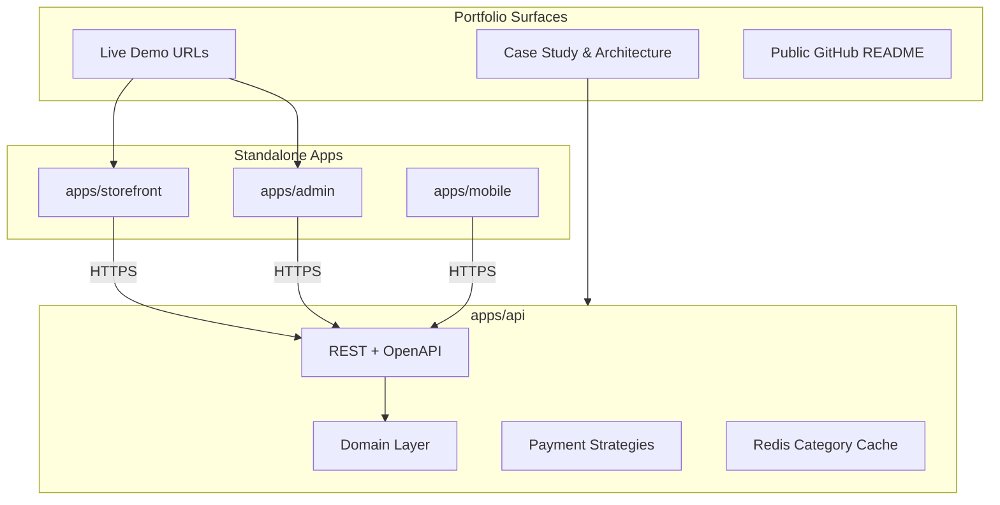

<p align="center">
  
</p>

<h1 align="center">E-Commerce Portfolio Ecosystem</h1>

<p align="center">
  <strong>A high-performance, production-ready developer portfolio showcase</strong>
</p>

<p align="center">
  <a href="https://github.com/EpicVibeCoder/e-commerce/actions/workflows/ci.yml"></a>
  
  
  
  
  
  
</p>

<p align="center">
  <a href="#-architecture--design">Architecture</a> •
  <a href="#-technical-stack">Tech Stack</a> •
  <a href="#-first-time-setup">Quick Start</a> •
  <a href="#-testing--quality-control">Testing</a> •
  <a href="#-database-management">Prisma DB</a> •
  <a href="#-demo-credentials">Demo Credentials</a>
</p>

---

## 🏗️ Architecture & Design

This project is structured as a **co-located standalone apps** repository (not a standard monorepo). Each application is completely independent with its own `package.json`, dependencies, and configurations. Root-level `workspaces` and `turbo` are utilized solely for developer convenience (running parallel checks and dev servers).



### ✨ Highlights & Engineering Standards

- **Clean Architecture & Domain-Driven Design**: The core domain logic ([`apps/api/src/domain/`](apps/api/src/domain)) resides in pure domain classes (`User`, `Product`, `Order`, `OrderItem`, `Payment`) separate from database/HTTP layers.
- **Strategy Pattern for Payments**: Dynamic support for multiple payment gateways—**Stripe** (global card payments) and **SSLCommerz** (regional sandbox environment) via unified payment strategies, complete with raw body parsing for webhook verification and idempotent stock updates.
- **DFS Caching**: Highly optimized category trees fetched using Depth-First Search (DFS) and cached in **Valkey/Redis** (`category:tree:v1`) with automatic invalidation on administrative updates.
- **Strict Quality Gates**: GitHub Actions execute separate parallel CI jobs per app ([`apps/api`](apps/api), [`apps/admin`](apps/admin), [`apps/storefront`](apps/storefront)) verifying code linting, typescript compilation, testing, and production build readiness.

---

## 💻 Technical Stack

| App / Service    | Path                                 | Tech                                            | Port   |
| :--------------- | :----------------------------------- | :---------------------------------------------- | :----- |
| **API**          | [`apps/api`](apps/api)               | NestJS 11 · Prisma 7 · Postgres · Jest          | `3000` |
| **Admin Panel**  | [`apps/admin`](apps/admin)           | Next.js 16 · Tailwind CSS 4 · TypeScript        | `3001` |
| **Storefront**   | [`apps/storefront`](apps/storefront) | Next.js 16 · Tailwind CSS 4 · TypeScript        | `3002` |
| **Mobile App**   | [`apps/mobile`](apps/mobile)         | Expo (React Native) — _Planned (Phase 10)_      | —      |
| **Orchestrator** | —                                    | Turborepo 2.9 (Task Runner & Caching Scheduler) | —      |
| **Database**     | —                                    | PostgreSQL 18.2 (Docker)                        | `5432` |
| **Cache Store**  | —                                    | Valkey 8.1.5 (Redis-compatible, Docker)         | `6379` |

---

## 📖 Design & Documentation

Architecture and API onboarding resources are available in the [`docs`](docs) directory:

- **Entity Relationship Diagram (ERD)**: [`docs/ERD.svg`](docs/ERD.svg) outlines the Postgres database schema and relationships.
- **Postman API Collection**: [`docs/postman-api-collection.json`](docs/postman-api-collection.json) provides pre-configured requests to test the API endpoints locally.
- **Development Plan**: [`.cursor/plans/portfolio_e-commerce_build_f1c2acb3.plan.md`](.cursor/plans/portfolio_e-commerce_build_f1c2acb3.plan.md) details the revised implementation timeline and roadmap.

---

## ⚙️ Prerequisites

- **Node.js** ≥ 20.19 (Node 24 recommended for Prisma 7 compatibility)
- **Docker & Docker Compose** (to run Postgres and Valkey)
- **npm** (recommended package manager)

---

## 📂 Project Layout

```text
e-commerce/
├── .github/workflows/      # parallel CI jobs for each app
├── .cursor/plans/          # detailed implementation plans
├── docs/                   # architecture, case studies, ERD, and generated assets
├── apps/
│   ├── api/                # NestJS 11 backend
│   │   ├── prisma/         # Prisma configuration, schema, and seeds
│   │   └── src/            # NestJS application code (domain, modules, config)
│   ├── admin/              # Next.js 16 Admin Panel
│   ├── storefront/         # Next.js 16 Client Storefront
│   └── mobile/             # Expo React Native App (Planned - Phase 10)
├── docker-compose.yml      # local infrastructure (Postgres + Valkey)
├── package.json            # root dependencies and developer tooling commands
└── .env.example            # template file for environment variables
```

---

## 🔒 Environment Variables

The repository uses a single root [`.env`](.env) file (copied from [`.env.example`](.env.example)) during local development to power all applications.

| Variable                             | Used By            | Description                                              |
| :----------------------------------- | :----------------- | :------------------------------------------------------- |
| `DATABASE_URL`                       | API · Prisma       | PostgreSQL database connection string                    |
| `APP_ENV`                            | API                | Application mode: `development`, `production`, or `test` |
| `PORT`                               | API                | The port the NestJS server listens on (default: `3000`)  |
| `CORS_ORIGINS`                       | API                | Comma-separated list of allowed origins for CORS         |
| `NEXT_PUBLIC_API_URL`                | Admin · Storefront | API URL used by frontends (e.g. `http://localhost:3000`) |
| `JWT_SECRET`                         | API                | Secret key used for signing Access JWTs                  |
| `JWT_EXPIRATION`                     | API                | Access token expiration duration (e.g., `1h`)            |
| `JWT_REFRESH_SECRET`                 | API                | Secret key used for signing Refresh JWTs                 |
| `JWT_REFRESH_EXPIRATION`             | API                | Refresh token expiration duration (e.g., `7d`)           |
| `REDIS_URL`                          | API                | Valkey/Redis connection string for category/DFS cache    |
| `GOOGLE_CLIENT_ID`                   | API                | Google OAuth client ID for customer authentication       |
| `GOOGLE_CLIENT_SECRET`               | API                | Google OAuth client secret                               |
| `STRIPE_SECRET_KEY`                  | API                | Secret key for Stripe payment processor                  |
| `STRIPE_WEBHOOK_SECRET`              | API                | Webhook signature verification key for Stripe            |
| `NEXT_PUBLIC_STRIPE_PUBLISHABLE_KEY` | Storefront         | Public key for Stripe Elements checkout                  |
| `SSLCOMMERZ_STORE_ID`                | API                | Store ID for SSLCommerz payment gateway                  |
| `SSLCOMMERZ_STORE_PASSWD`            | API                | Store password for SSLCommerz payment gateway            |
| `SSLCOMMERZ_IS_LIVE`                 | API                | Toggle live/sandbox gateway (`false` for sandbox)        |

---

## 🚀 First-Time Setup

Ensure all commands are executed from the **repository root** (`e-commerce/`).

### 1. Install Dependencies

Install all package dependencies (root and sub-apps) in one command:

```bash
npm run install:all
```

_Alternatively, install them incrementally using individual commands:_

Install root dependencies:

```bash
npm run install:root
```

Install API dependencies:

```bash
npm run install:api
```

Install Admin dependencies:

```bash
npm run install:admin
```

Install Storefront dependencies:

```bash
npm run install:storefront
```

### 2. Configure Environment

Copy the environment template:

```bash
cp .env.example .env
```

Open and configure the [`.env`](.env) file. The defaults are pre-configured to connect to the docker containers.

### 3. Spin Up Infrastructure

Start the PostgreSQL and Valkey services in detached mode:

```bash
docker compose up -d
```

### 4. Database Initialization

Generate the Prisma Client:

```bash
npm run db:generate
```

Deploy schema migrations:

```bash
npm run db:migrate
```

Seed sample data:

```bash
npm run db:seed
```

---

## 🛠️ Local Development

Run development servers from the **repository root** so that the shared root `.env` is loaded automatically.

### Run All Applications

Launches the API, Admin, and Storefront apps concurrently using Turborepo:

```bash
npm run dev
```

### Run Applications Individually

Run NestJS API only (http://localhost:3000/api/v1):

```bash
npm run dev:api
```

Run Admin dashboard only (http://localhost:3001):

```bash
npm run dev:admin
```

Run Storefront only (http://localhost:3002):

```bash
npm run dev:storefront
```

When the API boots up successfully, you should see:

```text
🚀 API is live — ready for requests
🌍 env:  development
🔌 port: 3000
🔗 url:  http://localhost:3000/api/v1
```

---

## 🧪 Testing & Quality Control

### Root Tooling Commands

Run checks across all apps from the repo root.

Run unit and integration tests across the project:

```bash
npm run test
```

Perform ESLint checks for all applications:

```bash
npm run lint
```

Compile and type-check TypeScript files:

```bash
npm run check-types
```

Format codebase with Prettier:

```bash
npm run format
```

### Running Checks for Specific Apps

#### NestJS API Checks

Run API tests:

```bash
npm run test --prefix apps/api
```

Run API linter:

```bash
npm run lint --prefix apps/api
```

Run API TypeScript type checks:

```bash
npm run check-types --prefix apps/api
```

#### Admin Panel Checks

Run Admin linter:

```bash
npm run lint --prefix apps/admin
```

Run Admin TypeScript type checks:

```bash
npm run check-types --prefix apps/admin
```

#### Storefront Checks

Run Storefront linter:

```bash
npm run lint --prefix apps/storefront
```

Run Storefront TypeScript type checks:

```bash
npm run check-types --prefix apps/storefront
```

---

## 🗄️ Database Management

Commands are run from the **repo root** and rely on the root [`.env`](.env) file:

| Action                                                              | Command                     |
| :------------------------------------------------------------------ | :-------------------------- |
| Generates the Prisma Client inside `apps/api/src/generated/prisma`  | `npm run db:generate`       |
| Runs Prisma development migrations                                  | `npm run db:migrate`        |
| Deploys migrations in a production environment                      | `npm run db:migrate:deploy` |
| Populates the database with demo accounts, categories, and products | `npm run db:seed`           |
| Launches Prisma Studio GUI                                          | `npm run db:studio`         |
| Wipes the database and reapplies all migrations (destructive)       | `npm run db:reset`          |

---

## 🌐 Deployed & Live Demo URLs

_(To be populated in Phase 7)_

- **API Base URL**: `http://localhost:3000/api/v1`
- **Storefront URL**: `http://localhost:3002`
- **Admin Panel URL**: `http://localhost:3001`

### 🔑 Demo Credentials

Seed data creates the following login credentials for sandbox testing:

| Role         | Email               | Password           |
| :----------- | :------------------ | :----------------- |
| **Admin**    | `admin@demo.local`  | `DemoPassword123!` |
| **Customer** | `demo@customer.com` | `DemoPassword123!` |

---

## ⚠️ Troubleshooting

| Issue                                   | Potential Cause / Resolution                                                                                           |
| :-------------------------------------- | :--------------------------------------------------------------------------------------------------------------------- |
| **Prisma/Node Version Incompatibility** | Ensure you are using Node.js ≥ 20.19 (`nvm use 24` is highly recommended for Prisma 7).                                |
| **API Startup / Validation Failures**   | Ensure the root [`.env`](.env) file exists and includes all required keys (`DATABASE_URL`, `JWT_SECRET`, etc.).        |
| **Database Connection Failures**        | Check that Docker is running (`docker ps`) and verify connectivity via `docker compose logs db`.                       |
| **Prisma Import/Types Errors**          | Run `npm run db:generate` before starting the development environment or seeding.                                      |
| **Frontends Cannot Reach API**          | Confirm `NEXT_PUBLIC_API_URL` is set to the correct backend host (usually `http://localhost:3000`) and restart NextJS. |

---

## 📄 License

Private portfolio showcase — all rights reserved unless explicitly stated otherwise.
