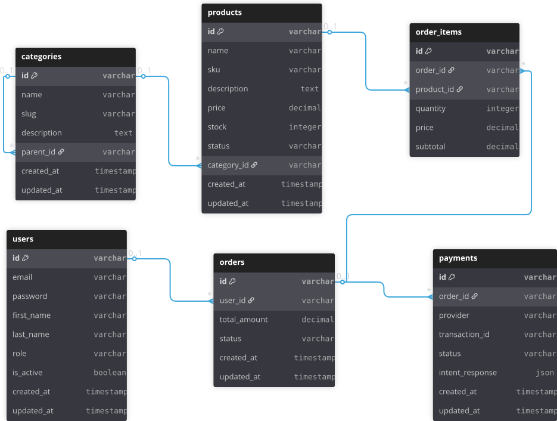

# Mini E-Commerce API

A comprehensive backend system for managing users, products, orders, and payments with support for multiple payment providers (Stripe, bKash). Built with NestJS, Prisma, MySQL, and Redis.

**This application is designed to run with Docker Compose** - all services (API, MySQL, Redis, Stripe CLI) are containerized and orchestrated together.

## Features

- ✅ User Management (Registration, Login, Profile)
- ✅ Product Management with OOP classes
- ✅ Category Management with DFS hierarchy traversal + Redis caching
- ✅ Product Recommendations using DFS algorithm
- ✅ Order Management with deterministic calculations
- ✅ Payment System with Strategy Pattern (Stripe fully implemented, **bKash partially implemented** ⚠️)
- ✅ Role-based Access Control (Admin/Customer)
- ✅ Session-based Authorization
- ✅ RESTful API with Swagger documentation
- ✅ Comprehensive test coverage

## ERD



## Architecture Diagram
~~~mermaid
flowchart TB
    subgraph GATEWAYS["Payment Gateways"]
        STRIPE_API[Stripe API]
        BKASH_API[bKash API]
    end

    subgraph STACK["Docker Compose Stack"]
        subgraph API["API Service"]
            API_SERVER[NestJS API Server<br/>Port 3000]
            subgraph MODULES["Core Modules"]
                PAY_MOD[Payments Module]
                ORD_MOD[Orders Module]
                PROD_MOD[Products Module]
                CAT_MOD[Categories Module]
                USER_MOD[Users Module]
                AUTH_MOD[Auth Module<br/>JWT + Passport]
            end
        end
        subgraph DATA["Data Services"]
            PRISMA[Prisma ORM]
            CACHE[Cache Manager]
            CONFIG[Config Module]
            THROTTLE[Throttler]
            MYSQL[(MySQL 8.4<br/>Relational DB)]
            REDIS[(Redis 7<br/>Cache Store)]
        end
        STRIPE_CLI[Stripe CLI<br/>Webhook Proxy]
    end

    CLIENT[Client Applications] -->|REST API| API_SERVER
    API_SERVER --> AUTH_MOD
    API_SERVER --> USER_MOD
    API_SERVER --> CAT_MOD
    API_SERVER --> PROD_MOD
    API_SERVER --> ORD_MOD
    API_SERVER --> PAY_MOD
    AUTH_MOD --> PRISMA
    USER_MOD --> PRISMA
    CAT_MOD --> PRISMA
    PROD_MOD --> PRISMA
    ORD_MOD --> PRISMA
    PAY_MOD --> PRISMA
    PRISMA --> MYSQL
    CAT_MOD --> CACHE
    PROD_MOD --> CACHE
    CACHE --> REDIS
    PAY_MOD -->|Strategy Pattern| STRIPE_API
    PAY_MOD -->|Strategy Pattern| BKASH_API
    STRIPE_API -->|Webhooks| STRIPE_CLI
    STRIPE_CLI -->|Forward| API_SERVER

    style STRIPE_API fill:#635bff,stroke:#fff,color:#fff
    style BKASH_API fill:#e91e63,stroke:#fff,color:#fff
    style API_SERVER fill:#4a90e2,stroke:#fff,color:#fff
    style MYSQL fill:#f39c12,stroke:#fff,color:#fff
    style REDIS fill:#e74c3c,stroke:#fff,color:#fff
~~~

## Payment Flow Diagram

~~~mermaid
flowchart TB
    subgraph INIT["Payment Initiation"]
        START[User Creates Order]
        INIT_NODE[POST /payments/initiate<br/>orderId + provider]
        START --> INIT_NODE
    end

    subgraph STRIPE["Stripe Flow ✅"]
        S1[Create Payment Intent]
        S2[Return clientSecret]
        S3[Frontend: Stripe.js Confirm]
        S4[Stripe Processes Payment]
        S5[Webhook: payment_intent.succeeded]
        S6[Update Payment Status]
        S7[Mark Order as PAID]
        S8[Reduce Stock]
        S1 --> S2 --> S3 --> S4 --> S5 --> S6 --> S7 --> S8
    end

    subgraph BKASH["bKash Flow ⚠️"]
        B1[Create Checkout]
        B2[Return paymentUrl]
        B3[Redirect to bKash]
        B4[bKash Processes Payment]
        B5[Callback: Execute Payment]
        B6[Update Payment Status]
        B7[Mark Order as PAID<br/>⚠️ May not work]
        B8[Reduce Stock<br/>⚠️ May not work]
        B1 --> B2 --> B3 --> B4 --> B5 --> B6 --> B7 --> B8
    end

    INIT_NODE -->|provider: stripe| S1
    INIT_NODE -->|provider: bkash| B1

    style START fill:#e3f2fd,stroke:#1976d2,stroke-width:2px,color:#000
    style INIT_NODE fill:#e3f2fd,stroke:#1976d2,stroke-width:2px,color:#000

    style S1 fill:#c8e6c9,stroke:#388e3c,stroke-width:2px,color:#000
    style S2 fill:#c8e6c9,stroke:#388e3c,stroke-width:2px,color:#000
    style S3 fill:#c8e6c9,stroke:#388e3c,stroke-width:2px,color:#000
    style S4 fill:#c8e6c9,stroke:#388e3c,stroke-width:2px,color:#000
    style S5 fill:#c8e6c9,stroke:#388e3c,stroke-width:2px,color:#000
    style S6 fill:#c8e6c9,stroke:#388e3c,stroke-width:2px,color:#000
    style S7 fill:#c8e6c9,stroke:#388e3c,stroke-width:2px,color:#000
    style S8 fill:#c8e6c9,stroke:#388e3c,stroke-width:2px,color:#000

    style B1 fill:#ffcdd2,stroke:#c62828,stroke-width:2px,color:#000
    style B2 fill:#ffcdd2,stroke:#c62828,stroke-width:2px,color:#000
    style B3 fill:#ffcdd2,stroke:#c62828,stroke-width:2px,color:#000
    style B4 fill:#ffcdd2,stroke:#c62828,stroke-width:2px,color:#000
    style B5 fill:#ffcdd2,stroke:#c62828,stroke-width:2px,color:#000
    style B6 fill:#ffcdd2,stroke:#c62828,stroke-width:2px,color:#000
    style B7 fill:#ffe0b2,stroke:#e65100,stroke-width:2px,color:#000
    style B8 fill:#ffe0b2,stroke:#e65100,stroke-width:2px,color:#000
~~~

## Prerequisites

- **Docker** (v20.10 or higher)
- **Docker Compose** (v2.0 or higher)
- **Node.js** (v20 or higher) - Only needed for local development without Docker

> **Note:** This application is primarily designed to run with Docker Compose. All services (API, MySQL, Redis, Stripe CLI) are containerized.

## Quick Start with Docker Compose (Recommended)

### 1. Clone the Repository

```bash
git clone <repository-url>
cd mini-ecommerce-api
```

### 2. Environment Configuration

Create a `.env` file in the root directory:

```env
# ============================================
# Application Configuration
# ============================================
NODE_ENV=development
PORT=3000

# Application URL (for payment callbacks)
APP_URL=http://localhost:3000

# ============================================
# Database Configuration
# ============================================
# Database connection details (used by Docker Compose)
DB_HOST=localhost
DB_PORT=3306
DB_NAME=mini_ecommerce
DB_USER=ecommerce_user
DB_PASSWORD=CHANGE_THIS_TO_SECURE_PASSWORD
DB_ROOT_PASSWORD=CHANGE_THIS_TO_SECURE_ROOT_PASSWORD

# For Docker/MySQL 8.4: Enable public key retrieval, disable SSL
DB_ALLOW_PUBLIC_KEY_RETRIEVAL=true
DB_SSL=false

# ============================================
# Redis Configuration
# ============================================
REDIS_HOST=localhost
REDIS_PORT=6379
# Optional: Redis password if using AUTH
# REDIS_PASSWORD=your_redis_password_here

# ============================================
# Security & Authentication
# ============================================
# JWT Secret Key (REQUIRED: Minimum 32 characters)
# Generate: openssl rand -base64 32
JWT_SECRET=CHANGE_THIS_TO_MINIMUM_32_CHARACTERS_SECRET_KEY
JWT_EXPIRES_IN=24h

# CORS Configuration
CORS_ORIGIN=http://localhost:3000

# ============================================
# Payment Gateway Configuration
# ============================================
# Stripe (Required for Stripe payments)
# Get from: https://dashboard.stripe.com/apikeys
STRIPE_SECRET_KEY=sk_test_your_stripe_secret_key_here
STRIPE_WEBHOOK_SECRET=whsec_your_webhook_secret_here

# bKash (⚠️ PARTIALLY IMPLEMENTED - Some features may not work)
# Get from: https://developer.bka.sh/ or https://pgw-integration.bkash.com/
BKASH_APP_KEY=your_bkash_app_key_here
BKASH_APP_SECRET=your_bkash_app_secret_here
BKASH_USERNAME=your_bkash_username_here
BKASH_PASSWORD=your_bkash_password_here
BKASH_BASE_URL=https://tokenized.sandbox.bka.sh/v1.2.0-beta
BKASH_IS_SANDBOX=true
```

**Important Notes:**
- Replace all placeholder values with your actual credentials
- Generate secure passwords and secrets:
  - `JWT_SECRET`: `openssl rand -base64 32`
  - `DB_PASSWORD`: Use a strong password generator
  - `DB_ROOT_PASSWORD`: Use a strong password generator
- Never commit `.env` to version control

### 3. Start All Services with Docker Compose

```bash
# Build and start all services (API, MySQL, Redis, Stripe CLI)
docker-compose up -d --build
```

This command will:
- Build the API container from the Dockerfile
- Start MySQL 8.4 container with health checks
- Start Redis 7 container with persistence
- Start Stripe CLI container for webhook forwarding
- Automatically run database migrations
- Seed the database with sample data

### 4. Verify Services are Running

```bash
# Check service status
docker-compose ps

# View API logs
docker-compose logs -f api

# View all logs
docker-compose logs -f
```

### 5. Access the Application

- **API**: `http://localhost:3000/api/v1`
- **Swagger Documentation**: `http://localhost:3000/api/docs`
- **Health Check**: `http://localhost:3000`

The database is automatically seeded with:
- Admin user: `admin@example.com` / `admin123`
- Customer user: `customer@example.com` / `admin123`
- 5 categories with hierarchical structure
- 40 sample products across categories

## Docker Compose Services

The `docker-compose.yml` includes:

1. **MySQL 8.4** - Database with health checks and data persistence
2. **Redis 7** - Cache with AOF persistence and memory management
3. **API** - NestJS application (built from Dockerfile)
4. **Stripe CLI** - Automatically forwards Stripe webhooks to the API

All services are networked together and have health checks to ensure proper startup order.

## Docker Commands

```bash
# Start all services
docker-compose up -d --build

# View logs
docker-compose logs -f api          # API logs only
docker-compose logs -f               # All services

# Stop services
docker-compose down

# Stop and remove volumes (clean slate - deletes all data)
docker-compose down -v

# Restart a specific service
docker-compose restart api

# Rebuild and restart
docker-compose up -d --build --force-recreate
```

## Local Development (Without Docker)

If you prefer to run services locally without Docker:

### Prerequisites
- Node.js v20+
- MySQL 8.4+ running locally
- Redis 7+ running locally

### Setup Steps

1. **Install Dependencies**
   ```bash
   npm install
   ```

2. **Configure Environment**
   - Create `.env` file (see template above)
   - Set `DATABASE_URL` or individual DB variables
   - Set `REDIS_HOST=localhost`

3. **Generate Prisma Client**
   ```bash
   npx prisma generate
   ```

4. **Run Migrations**
   ```bash
   npx prisma migrate deploy
   # or for development:
   npx prisma migrate dev
   ```

5. **Seed Database**
   ```bash
   npm run prisma:seed
   ```

6. **Start Application**
   ```bash
   # Development mode (with hot reload)
   npm run start:dev

   # Production mode
   npm run build
   npm run start:prod
   ```

## API Documentation

### Swagger UI

Once the server is running, access Swagger documentation at:
```
http://localhost:3000/api/docs
```

### Postman Collection

Import `mini-ecommerce-postman-collection.json` into Postman for comprehensive API testing.

**Base URL**: `http://localhost:3000/api/v1`

## API Endpoints

### Authentication
- `POST /api/v1/auth/register` - Register new user
- `POST /api/v1/auth/login` - Login user

### Users
- `GET /api/v1/users/profile` - Get current user profile
- `GET /api/v1/users/orders` - Get user's orders
- `GET /api/v1/users/payments` - Get user's payments
- `GET /api/v1/users/:id` - Get user by ID (Admin only)
- `PATCH /api/v1/users/:id` - Update user (Admin or own profile)

### Categories
- `GET /api/v1/categories` - Get category hierarchy (DFS + Redis cache)
- `GET /api/v1/categories/:id` - Get category by ID
- `POST /api/v1/categories` - Create category (Admin only)
- `PATCH /api/v1/categories/:id` - Update category (Admin only)
- `DELETE /api/v1/categories/:id` - Delete category (Admin only)

### Products
- `GET /api/v1/products` - Get all products
- `GET /api/v1/products/:id` - Get product by ID
- `GET /api/v1/products/sku/:sku` - Get product by SKU
- `GET /api/v1/products/:id/recommendations` - Get product recommendations (DFS)
- `GET /api/v1/products/category/:categoryId` - Get products by category
- `POST /api/v1/products` - Create product (Admin only)
- `PATCH /api/v1/products/:id` - Update product (Admin only)
- `DELETE /api/v1/products/:id` - Delete product (Admin only)

### Orders
- `POST /api/v1/orders` - Create order
- `GET /api/v1/orders` - Get user's orders
- `GET /api/v1/orders/:id` - Get order by ID (Admin only)
- `PATCH /api/v1/orders/:id/cancel` - Cancel order

### Payments
- `POST /api/v1/payments/initiate` - Initiate payment (Stripe/bKash)
- `GET /api/v1/payments` - Get user's payments
- `GET /api/v1/payments/callback/bkash` - bKash callback
- `POST /api/v1/payments/webhooks/stripe` - Stripe webhook
- `POST /api/v1/payments/webhooks/bkash` - bKash webhook

## Testing

### Run Unit Tests

```bash
# Run all tests
npm test

# Run tests in watch mode
npm run test:watch

# Run tests with coverage
npm run test:cov
```

### Run E2E Tests

```bash
npm run test:e2e
```

## Payment Provider Setup

### Stripe

1. Create account at [stripe.com](https://stripe.com)
2. Get API keys from Dashboard → Developers → API keys
3. Add to `.env`:
   ```env
   STRIPE_SECRET_KEY=sk_test_...
   STRIPE_WEBHOOK_SECRET=whsec_...
   ```
4. **With Docker Compose**: Stripe CLI container automatically forwards webhooks
5. **Without Docker**: Use Stripe CLI locally:
   ```bash
   stripe listen --forward-to http://localhost:3000/api/v1/payments/webhooks/stripe
   ```

### bKash (⚠️ Partially Implemented)

> **Warning:** bKash integration is **partially implemented**. Some features may not be fully functional. Use at your own risk.

1. Register at [bKash Developer Portal](https://developer.bka.sh) or [bKash Payment Gateway Integration](https://pgw-integration.bkash.com/)
2. Get sandbox credentials for testing
3. Add to `.env`:
   ```env
   BKASH_APP_KEY=your_bkash_app_key_here
   BKASH_APP_SECRET=your_bkash_app_secret_here
   BKASH_USERNAME=your_bkash_username_here
   BKASH_PASSWORD=your_bkash_password_here
   BKASH_BASE_URL=https://tokenized.sandbox.bka.sh/v1.2.0-beta
   BKASH_IS_SANDBOX=true
   ```
4. For production:
   - Update `BKASH_BASE_URL` to: `https://tokenized.pay.bka.sh/v1.2.0-beta`
   - Set `BKASH_IS_SANDBOX=false`
   - Use production credentials from bKash

## Development

### Project Structure

```
src/
├── auth/              # Authentication module
├── users/             # User management
├── categories/        # Category management (DFS + caching)
├── products/          # Product management + recommendations
├── orders/            # Order management
├── payments/          # Payment system (Strategy pattern)
│   └── strategies/   # Stripe & bKash strategies
├── prisma/            # Prisma service
└── main.ts            # Application entry point
```

### Key Features Implementation

- **OOP Classes**: User, Product, Order, Payment entities with business logic
- **Strategy Pattern**: Payment providers (Stripe fully implemented, bKash partially implemented ⚠️)
- **DFS Algorithm**: Category hierarchy traversal and product recommendations
- **Redis Caching**: Category tree and product recommendations cached
- **Deterministic Algorithms**: Order totals, stock reduction

### Database Migrations

```bash
# Create new migration
npx prisma migrate dev --name migration_name

# Apply migrations (Docker)
docker-compose exec api npx prisma migrate deploy

# Apply migrations (Local)
npx prisma migrate deploy

# Reset database (development only)
npx prisma migrate reset
```

### Prisma Studio (Database GUI)

```bash
# With Docker
docker-compose exec api npx prisma studio

# Local
npx prisma studio
```

Access at: `http://localhost:5555`

## Environment Variables Reference

| Variable | Required | Default | Description |
|----------|----------|---------|-------------|
| `NODE_ENV` | No | `development` | Environment mode |
| `PORT` | No | `3000` | Server port |
| `APP_URL` | No | `http://localhost:3000` | Application URL for payment callbacks |
| `DB_HOST` | Yes* | `localhost` | Database host |
| `DB_PORT` | No | `3306` | Database port |
| `DB_NAME` | Yes* | - | Database name |
| `DB_USER` | Yes* | - | Database user |
| `DB_PASSWORD` | Yes* | - | Database password |
| `DB_ROOT_PASSWORD` | Yes* | - | MySQL root password (Docker only) |
| `DB_ALLOW_PUBLIC_KEY_RETRIEVAL` | Yes | - | `true` or `false` |
| `DB_SSL` | Yes | - | `true` or `false` |
| `REDIS_HOST` | Yes | - | Redis host |
| `REDIS_PORT` | No | `6379` | Redis port |
| `REDIS_PASSWORD` | No | - | Redis password (optional) |
| `JWT_SECRET` | Yes | - | JWT secret (min 32 chars, generate: `openssl rand -base64 32`) |
| `JWT_EXPIRES_IN` | No | `24h` | JWT expiration |
| `CORS_ORIGIN` | No | `*` | CORS allowed origins |
| `STRIPE_SECRET_KEY` | No | - | Stripe API key |
| `STRIPE_WEBHOOK_SECRET` | No | - | Stripe webhook secret |
| `BKASH_APP_KEY` | No | - | bKash app key (⚠️ Partially implemented) |
| `BKASH_APP_SECRET` | No | - | bKash app secret (⚠️ Partially implemented) |
| `BKASH_USERNAME` | No | - | bKash username (⚠️ Partially implemented) |
| `BKASH_PASSWORD` | No | - | bKash password (⚠️ Partially implemented) |
| `BKASH_BASE_URL` | No | `https://tokenized.sandbox.bka.sh/v1.2.0-beta` | bKash API base URL (⚠️ Partially implemented) |
| `BKASH_IS_SANDBOX` | No | `true` | bKash sandbox mode (⚠️ Partially implemented) |

*Required when using Docker Compose. For local development, you can use `DATABASE_URL` instead.

## Troubleshooting

### Docker Issues

```bash
# Check service status
docker-compose ps

# View logs
docker-compose logs -f api

# Restart services
docker-compose restart

# Rebuild containers
docker-compose up -d --build --force-recreate
```

### Database Connection Issues

- Ensure MySQL container is running: `docker-compose ps`
- Check container logs: `docker-compose logs mysql`
- Verify credentials in `.env` file
- Wait for health checks to pass (about 30 seconds after startup)

### Redis Connection Issues

- Ensure Redis container is running: `docker-compose ps`
- Check container logs: `docker-compose logs redis`
- Test connection: `docker-compose exec redis redis-cli ping`

### Prisma Issues

```bash
# Regenerate Prisma Client (Docker)
docker-compose exec api npx prisma generate

# Run migrations (Docker)
docker-compose exec api npx prisma migrate deploy

# Seed database (Docker)
docker-compose exec api npx prisma db seed
```

### Port Already in Use

```bash
# Find process using port 3000
# Windows:
netstat -ano | findstr :3000

# Mac/Linux:
lsof -i :3000

# Change PORT in .env or stop conflicting service
```

## Production Deployment

### Using Docker Compose

1. Set `NODE_ENV=production` in `.env`
2. Set `APP_URL` to your production backend URL
3. Use managed database (set `DATABASE_URL` in `.env`)
4. Use managed Redis (set `REDIS_HOST` to your Redis service)
5. Set strong `JWT_SECRET` (generate: `openssl rand -base64 32`)
6. Configure production payment provider keys:
   - Stripe: Use `sk_live_...` keys
   - bKash: Update `BKASH_BASE_URL` to production URL and set `BKASH_IS_SANDBOX=false` (⚠️ Partially implemented)
7. Enable SSL for database (`DB_SSL=true`, `DB_ALLOW_PUBLIC_KEY_RETRIEVAL=false`)
8. Set appropriate `CORS_ORIGIN` to your frontend domain(s)
9. Build and deploy:
   ```bash
   docker-compose -f docker-compose.yml up -d --build
   ```

### Using Container Orchestration (Kubernetes, ECS, etc.)

1. Build Docker image: `docker build -t mini-ecommerce-api .`
2. Push to container registry
3. Deploy with managed MySQL and Redis services
4. Configure environment variables in your orchestration platform
5. Set up health checks and auto-scaling

## License

MIT
